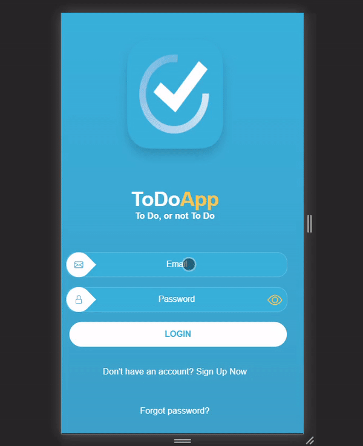

# Random Quote Machine
> Random Quote Machine that displays data from "https://gist.githubusercontent.com/camperbot/5a022b72e96c4c9585c32bf6a75f62d9/raw/e3c6895ce42069f0ee7e991229064f167fe8ccdc/quotes.json"

## Table of contents
* [Technologies](#technologies)
* [Screenshots](#screenshots)
* [Features](#features)
* [Status](#status)

## Technologies
* HTML
* CSS
* JavaScript
* Firebase

## Screenshots

## Features
List of features ready and TODOs for future development
* Displays random quotes
* Changes the quote once quote box is clicked
* Sets Random color scheme for every quote
* Twitter and Tumblr buttons that redirects user to said sites and prompts new tweet / post with quote and author content

To-do list:
* Refactor Code
* Possibly change project to be Google Chrome Extension that will be displayed on Home / Start-up page
* Project was initially created in with sole purpose of practicing JavaScript and DOM manipulation. 
Responsive design was not included. Future version of the project might include media queries for all screen sizes

## Status
Project is: Completed
